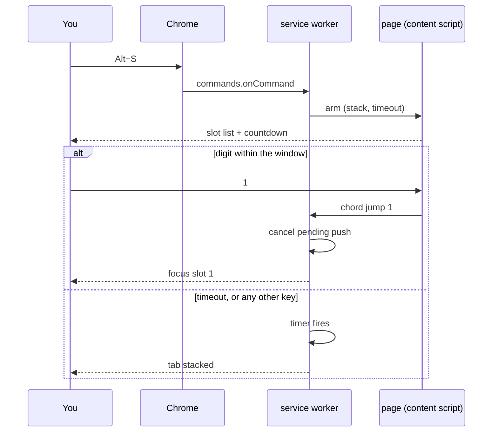
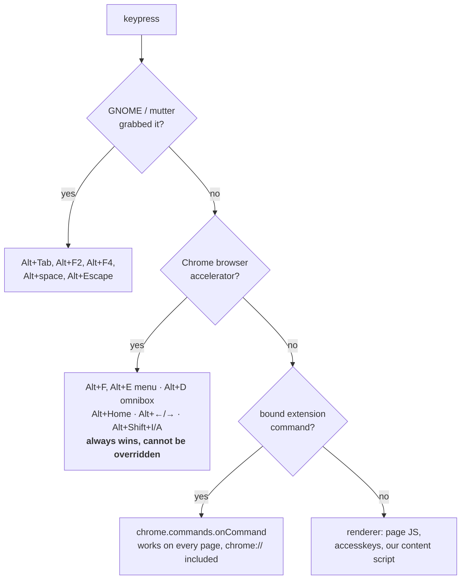
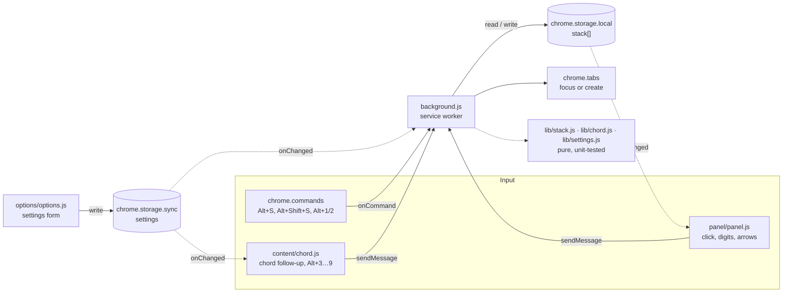
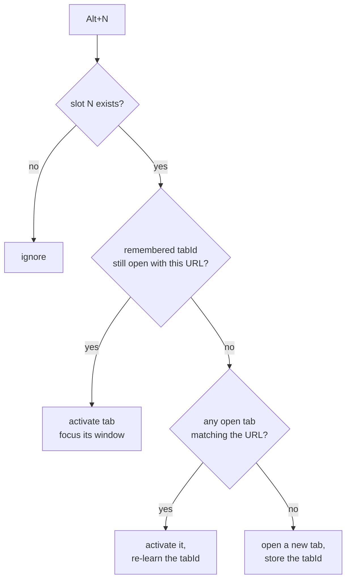

# Tabstack

A keyboard-driven stack of tabs, living in the Chrome side panel.

`Alt+S` is the leader: press it and a numbered list of the stack appears on the
page. Follow it with `1`…`9` to jump to that slot; press anything else, or just
wait, and it stacks the current tab instead. The side panel shows the same list
in the same order, so what you see and what you type never disagree.


## Install (unpacked)

1. `git clone https://github.com/demian-overflow/tabstack.git`
2. Open `chrome://extensions`, enable **Developer mode**.
3. **Load unpacked** → pick the repo directory.
4. Pin the toolbar icon; clicking it opens the side panel.

Requires Chrome 116+ (Side Panel API).

## Keys

| Key | Action | Where it works |
| --- | --- | --- |
| `Alt+S` | Arm the chord, or stack the tab | Everywhere (Chrome command) |
| `Alt+S` then `1…9` | Jump to that slot | Normal pages (needs the chord) |
| `Alt+S` then `⇧`+`1…9` | Remove that slot | Normal pages |
| `Alt+S` then `Esc` | Cancel — no stack, no jump | Normal pages |
| `Alt+Shift+S` | Open the side panel | Everywhere (Chrome command) |
| `Alt+1`, `Alt+2` | Jump to slot 1 / 2, no leader | Everywhere (Chrome command) |
| `Alt+3` … `Alt+9` | Jump to slot 3 … 9, no leader | Normal pages (content script) |
| `Alt+Shift+1…9` | Remove that slot | Normal pages (content script) |
| `1` … `9` | Jump, when the panel has focus | Side panel |
| `↑` `↓` / `Enter` / `Backspace` | Select / open / remove | Side panel |
| `Alt+↑` `Alt+↓` | Reorder the selected item | Side panel |

Pushing a URL that is already stacked refreshes it in place rather than adding a
duplicate, and new tabs are **appended**, so a slot number stays put for as long
as that item lives. Muscle memory survives.

Everything above is configurable, including turning the leader off entirely —
see [Settings](#settings).

### How the chord actually works

`chrome.commands` registers single accelerators; there is no sequence syntax, so
`Alt+S`-then-`1` cannot be one command. It is split in two:



The push is *deferred*, not undone: nothing is written until the window closes.
The cost is that `Alt+S` alone takes `leaderTimeoutMs` to land — which is why
the countdown bar exists, and why the window is adjustable.

On a page where no content script can run — `chrome://`, the Web Store, the PDF
viewer, the new tab page — nothing answers the arm message, so the service
worker stacks the tab immediately instead of arming a chord that could never be
completed. The direct `Alt+1`/`Alt+2` commands keep working there too.

### Why these keys

Four separate layers get a veto over a keystroke before your extension code
runs, and each one is absolute — there is no "please let me have it" API.



That top-down order is why the obvious binding does not work:

- **`Alt+F` is impossible.** It is Chrome's own menu accelerator on Windows and
  Linux (so is `Alt+E`), and the docs are explicit that browser shortcuts take
  priority and cannot be overridden. `chrome://extensions/shortcuts` will let you
  type it; it just never fires.
- **`Ctrl+E` is out for the same reason** — it is Chrome's *search from
  anywhere*, the twin of `Ctrl+K`. `Ctrl`+letter is nearly full: Chrome owns
  D F G H J K L N O P R S T U W, and A C V X Y Z are the universal edit keys.
- **`Alt+S` is free**, and so is the digit row: Chrome switches tabs with
  `Ctrl+1…8`, not `Alt`, and GNOME's launcher shortcuts are on `Super`. Watch
  out when testing across browsers, though — Firefox's `Alt` bindings are a
  different set entirely, and a collision there says nothing about Chrome.
- **Letters carry one risk digits do not**: a page `accesskey` or a GTK menu
  mnemonic can claim them at the renderer layer (a *bound command* still wins),
  and — see below — a letter can stop matching when you switch layout.

Two more limits shape the layout:

- **Only four shortcuts can ship pre-assigned** (`suggested_key`), no matter how
  many commands the extension declares. Nine slots do not fit, so the four go to
  what must work on `chrome://` pages — the leader, the panel, and slots 1 and 2
  — and the rest are declared unbound for you to assign, or handled in-page.
  The leader chord exists precisely to reach the other slots without spending
  binds on them.
- **The grammar is narrow.** Every shortcut must contain `Ctrl` or `Alt`, with
  `Shift` optional. `Ctrl+Alt+…` is rejected outright (to stay clear of `AltGr`),
  and there is no `Super`/`Meta` modifier, no `F1`–`F12`, and no `Fn` — the `Fn`
  key is resolved inside the keyboard's own firmware and never reaches the
  kernel, let alone the browser.

`Alt+3`…`Alt+9` therefore run in a content script, which has no four-key limit
but only reaches pages an extension may inject into — not `chrome://`, the Web
Store, or the PDF viewer. If you lean on one of those slots, bind it once at
`chrome://extensions/shortcuts` and it starts working everywhere.

### Non-Latin keyboard layouts

If you keep several layouts (`us,ru,ua`, say), letter-based *commands* are the
thing most likely to break: under a Cyrillic layout the physical `S` key no
longer reports as `S`. Digits do not move — `1` is `1` in Latin and Cyrillic
alike — so `Alt+1`/`Alt+2` are the safest bindings on such a machine.

Everything Tabstack handles itself is immune: both the chord follow-up and the
direct `Alt+3…9` match on `event.code`, the physical key position, so they work
the same under any layout. If `Alt+S` ever stops firing after a layout switch,
that is Chrome's binding, not the extension's — rebind the leader to a digit at
`chrome://extensions/shortcuts` and the chord behaves identically.

### Making a shortcut work outside Chrome

An extension command is browser-scoped by default: Chrome must be focused. A
command can ask for `"global": true` so it fires system-wide, but Chrome only
accepts `Ctrl+Shift+[0…9]` for those — a three-finger chord for something you
press dozens of times an hour, so Tabstack skips it. Anything richer (a GNOME
custom shortcut that talks to the extension while Chrome is in the background)
needs a native messaging host, which is a much bigger surface than this
prototype wants.

If the legal combinations genuinely run out, the fix belongs below the browser:
a remapper like [`keyd`](https://github.com/rvaiya/keyd) can turn an unused
physical key — `Menu`, `Caps Lock` — into a held layer that *emits* `Alt+digit`.
Chrome then sees an ordinary, legal shortcut and never knows the difference,
which is the closest thing to an `Fn` layer that an extension can be given.

Shortcuts you assign by hand live in the profile, not in the extension:
`~/.config/google-chrome/<Profile>/Preferences` under `extensions.commands`.
Chrome exposes no policy for pre-seeding them, so a fresh machine means
re-binding by hand at `chrome://extensions/shortcuts` — the four defaults above
exist precisely so that is optional. The settings page reads them back with
`chrome.commands.getAll()` so you can see what Chrome actually accepted.

## Settings

Open them from the gear in the side panel, or right-click the toolbar icon →
*Options*.

| Setting | Default | What it changes |
| --- | --- | --- |
| Mode | `leader` | `leader` arms the chord; `direct` stacks the moment you press `Alt+S` |
| Chord window | `700 ms` | How long a digit still counts after the leader |
| Slot list on page | on | The countdown HUD while armed |
| `Alt+1…9` jumps | on | Direct jumps without the leader |
| `Alt+⇧+1…9` removes | on | Direct removal |
| Confirmation bubbles | on | The on-page toasts |
| New tab lands | bottom | `top` makes the newest slot 1, at the cost of renumbering |
| Reuse open tab | on | Focus an existing tab with that URL instead of opening a second |

### Where state lives

Three different stores, because three different things are being kept:

| What | Where | Why there |
| --- | --- | --- |
| Settings | `chrome.storage.sync` | Small, and worth roaming with your Chrome profile to a second machine |
| The stack | `chrome.storage.local` | Device-specific tab state, and far past `sync`'s 8 KB-per-item quota |
| Key bindings | The browser profile — `Preferences` → `extensions.commands` | Chrome owns them; an extension may *suggest* four defaults and read the rest via `chrome.commands.getAll()`, but there is **no API to set one** |

That last row is why the settings page shows your live bindings read-only, with
a button through to `chrome://extensions/shortcuts`. Anything claiming to rebind
an extension shortcut from inside the extension is claiming something the
platform does not offer.

Settings are validated in one place — `normalize()` in `lib/settings.js` — so
hand-edited or out-of-date storage degrades to the defaults instead of reaching
the service worker as a bad value.

## How it works



The service worker is the only writer. Every input path — keyboard command,
content script, panel click — funnels into the same handlers, and the panel
re-renders off `storage.onChanged` rather than keeping its own copy. That is why
the visual order and the keyboard order cannot drift apart.

`lib/stack.js` holds the ordering rules as pure functions with no Chrome APIs in
them, so the part that is easy to get subtly wrong is the part that runs under
`node --test`.

### Jumping to a slot



URLs compare equal when they differ only by fragment, so `#section` links don't
strand an item. Closing a tab clears the remembered id but keeps the stack entry
— the slot still works, it just opens fresh.

## Data

The stack, in `chrome.storage.local`:

```jsonc
{
  "stack": [
    {
      "id": "1756... -k3f9a",   // stable identity across refreshes
      "url": "https://example.dev/docs",
      "title": "Docs — Example",
      "favIconUrl": "https://example.dev/favicon.ico",
      "tabId": 42,               // last known live tab, or null
      "addedAt": 1756000000000
    }
  ]
}
```

Nothing leaves the browser: no network calls, no analytics, no remote host
permissions.

## Development

```bash
npm test                    # pure logic: stack, chord, settings — node --test
python3 tools/make-icons.py # regenerate icons (no image deps)
```

The three `lib/` modules hold everything that is easy to get subtly wrong —
slot renumbering, which key resolves the chord, settings validation — with no
Chrome APIs in them, so they run under `node --test` rather than by hand in a
browser. `content/chord.js` inlines a copy of `resolve()` because content
scripts are not ES modules; the test suite covers the module, and the copy is
kept to the same handful of lines deliberately.

After editing, hit the reload arrow on `chrome://extensions`. Content-script
changes need the *page* reloaded too; service-worker changes do not.

Permissions the manifest asks for, and why:

| Permission | Why |
| --- | --- |
| `tabs` | Read the current tab's URL/title to stack it, and search open tabs to re-focus one instead of duplicating it |
| `storage` | Persist the stack across restarts |
| `sidePanel` | The UI |
| `<all_urls>` content script | The `Alt+3…9` key handler; it never reads page content |

## Status

Prototype (v0.2.0) — unpacked install, no Web Store listing. Known gaps:

- No drag-to-reorder in the panel (arrow buttons and `Alt+↑/↓` only).
- Slots beyond 9 are stored and clickable but have no keyboard binding — the
  chord reads a single digit, not a multi-digit number.
- The pending push is held in the service worker's memory. If Chrome tears the
  worker down inside the chord window the push is dropped; at sub-second windows
  this has not been observed, but it is not guaranteed by the platform.
- The stack is global, not per-window or per-profile-session.

## License

MIT
