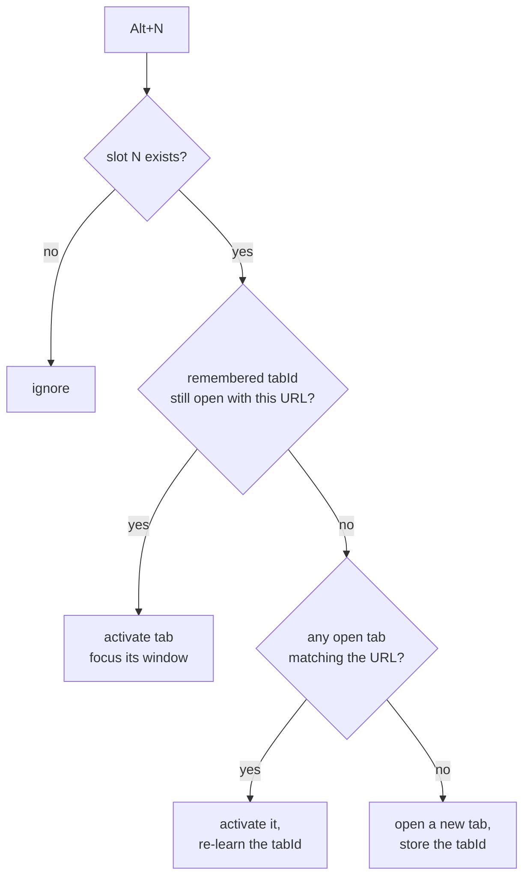

# Tabstack

A keyboard-driven stack of tabs, living in the Chrome side panel.

`Alt+F` pushes the current tab onto a numbered stack. `Alt+1` … `Alt+9` jump
straight back to it. The side panel shows the same list in the same order, so
what you see and what you type never disagree.


## Install (unpacked)

1. `git clone https://github.com/demian-overflow/tabstack.git`
2. Open `chrome://extensions`, enable **Developer mode**.
3. **Load unpacked** → pick the repo directory.
4. Pin the toolbar icon; clicking it opens the side panel.

Requires Chrome 116+ (Side Panel API).

## Keys

| Key | Action | Where it works |
| --- | --- | --- |
| `Alt+F` | Stack the current tab | Everywhere (Chrome command) |
| `Alt+Shift+F` | Open the side panel | Everywhere (Chrome command) |
| `Alt+1`, `Alt+2` | Jump to slot 1 / 2 | Everywhere (Chrome command) |
| `Alt+3` … `Alt+9` | Jump to slot 3 … 9 | Normal pages (content script) |
| `Alt+Shift+1…9` | Remove that slot | Normal pages (content script) |
| `1` … `9` | Jump, when the panel has focus | Side panel |
| `↑` `↓` / `Enter` / `Backspace` | Select / open / remove | Side panel |
| `Alt+↑` `Alt+↓` | Reorder the selected item | Side panel |

Pushing a URL that is already stacked refreshes it in place rather than adding a
duplicate, and new tabs are **appended**, so a slot number stays put for as long
as that item lives. Muscle memory survives.

### About the Chrome shortcut limits

Chrome lets an extension pre-assign only **four** keyboard shortcuts, which is
short of the nine slots this needs, and it registers single chords — `Alt+F+1`
as one command is not something the commands API can express.

Rather than build a leader-key state machine (`Alt+F`, *then* `1`), which costs a
timeout on the most common keystroke, Tabstack splits the work:

- The four pre-assigned commands go to the actions that must work *everywhere*,
  including on `chrome://` pages: push, open panel, and slots 1–2.
- `Alt+3`…`Alt+9` are handled by a content script, which has no such limit.
  Identical behaviour, but only on pages an extension may inject into — not
  `chrome://`, the Web Store, or the PDF viewer.
- All nine slots are also declared as real commands, unbound. If you lean on a
  particular slot, bind it once at `chrome://extensions/shortcuts` and it starts
  working everywhere too.

One thing to verify on your machine: **`Alt+F` is also Chrome's own menu
accelerator** on Windows/Linux. The extension command normally wins, but if it
doesn't on your setup, rebind push at `chrome://extensions/shortcuts` — the
content script also handles `Alt+F` as a fallback for exactly this case, so
pages keep working while `chrome://` pages don't.

## How it works


The service worker is the only writer. Every input path — keyboard command,
content script, panel click — funnels into the same handlers, and the panel
re-renders off `storage.onChanged` rather than keeping its own copy. That is why
the visual order and the keyboard order cannot drift apart.

`lib/stack.js` holds the ordering rules as pure functions with no Chrome APIs in
them, so the part that is easy to get subtly wrong is the part that runs under
`node --test`.

### Jumping to a slot



URLs compare equal when they differ only by fragment, so `#section` links don't
strand an item. Closing a tab clears the remembered id but keeps the stack entry
— the slot still works, it just opens fresh.

## Data

One key in `chrome.storage.local`:

```jsonc
{
  "stack": [
    {
      "id": "1756... -k3f9a",   // stable identity across refreshes
      "url": "https://example.dev/docs",
      "title": "Docs — Example",
      "favIconUrl": "https://example.dev/favicon.ico",
      "tabId": 42,               // last known live tab, or null
      "addedAt": 1756000000000
    }
  ]
}
```

Nothing leaves the browser: no network calls, no analytics, no remote host
permissions.

## Development

```bash
npm test                    # pure stack logic, node --test
python3 tools/make-icons.py # regenerate icons (no image deps)
```

After editing, hit the reload arrow on `chrome://extensions`. Content-script
changes need the *page* reloaded too; service-worker changes do not.

Permissions the manifest asks for, and why:

| Permission | Why |
| --- | --- |
| `tabs` | Read the current tab's URL/title to stack it, and search open tabs to re-focus one instead of duplicating it |
| `storage` | Persist the stack across restarts |
| `sidePanel` | The UI |
| `<all_urls>` content script | The `Alt+3…9` key handler; it never reads page content |

## Status

Prototype (v0.1.0) — unpacked install, no Web Store listing. Known gaps:

- No drag-to-reorder in the panel (arrow buttons and `Alt+↑/↓` only).
- Slots beyond 9 are stored and clickable but have no keyboard binding.
- The stack is global, not per-window or per-profile-session.

## License

MIT
