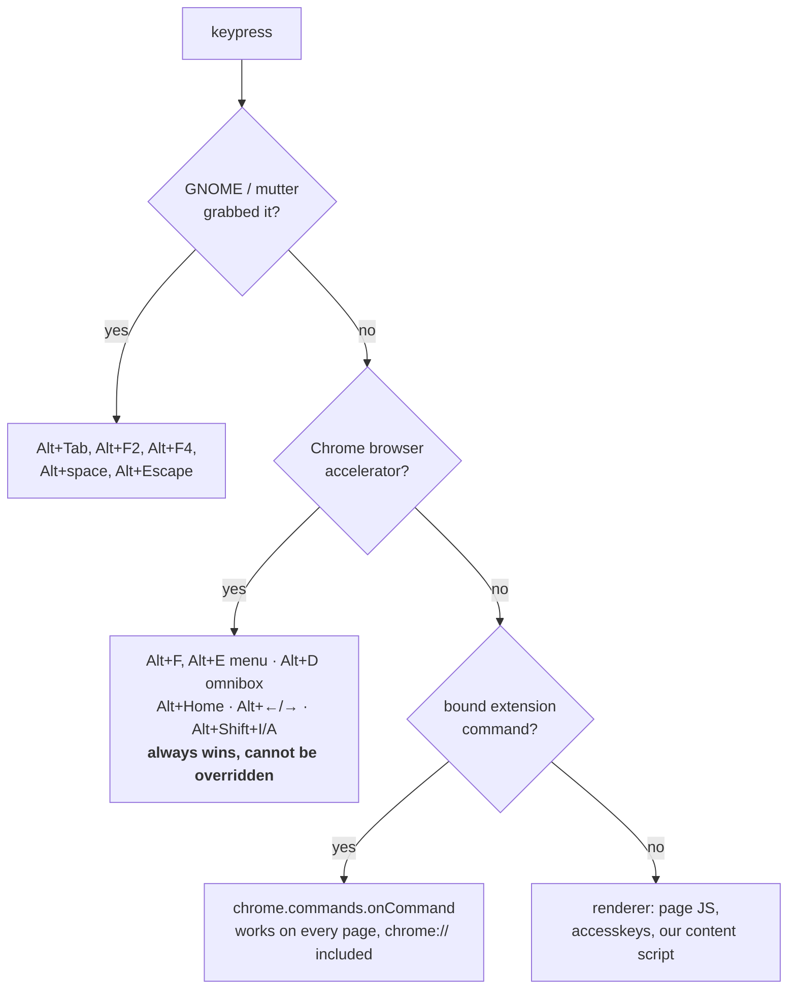
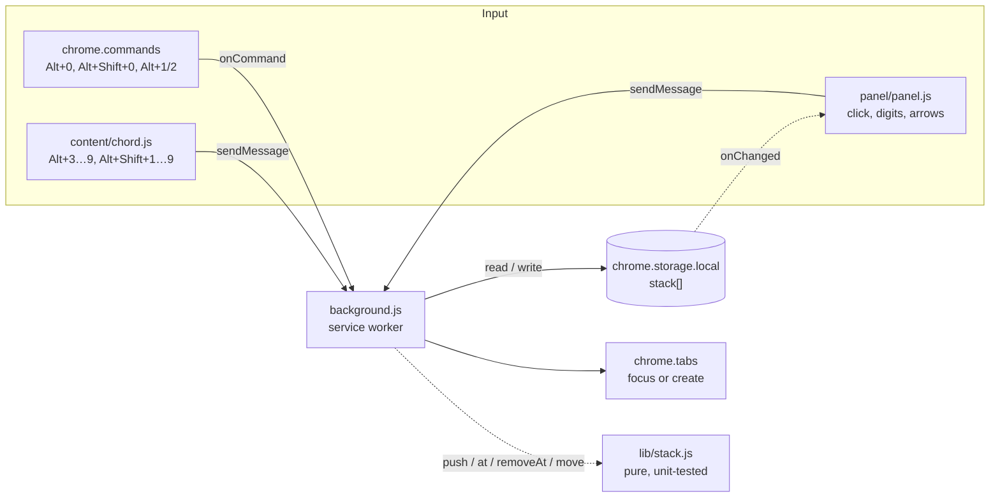
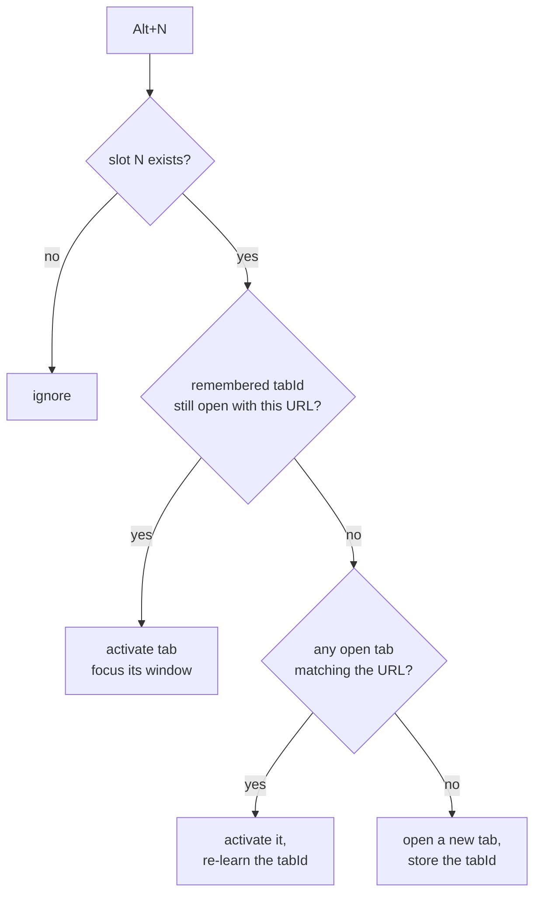

# Tabstack

A keyboard-driven stack of tabs, living in the Chrome side panel.

`Alt+0` pushes the current tab onto a numbered stack. `Alt+1` … `Alt+9` jump
straight back to it. The side panel shows the same list in the same order, so
what you see and what you type never disagree.


## Install (unpacked)

1. `git clone https://github.com/demian-overflow/tabstack.git`
2. Open `chrome://extensions`, enable **Developer mode**.
3. **Load unpacked** → pick the repo directory.
4. Pin the toolbar icon; clicking it opens the side panel.

Requires Chrome 116+ (Side Panel API).

## Keys

| Key | Action | Where it works |
| --- | --- | --- |
| `Alt+0` | Stack the current tab | Everywhere (Chrome command) |
| `Alt+Shift+0` | Open the side panel | Everywhere (Chrome command) |
| `Alt+1`, `Alt+2` | Jump to slot 1 / 2 | Everywhere (Chrome command) |
| `Alt+3` … `Alt+9` | Jump to slot 3 … 9 | Normal pages (content script) |
| `Alt+Shift+1…9` | Remove that slot | Normal pages (content script) |
| `1` … `9` | Jump, when the panel has focus | Side panel |
| `↑` `↓` / `Enter` / `Backspace` | Select / open / remove | Side panel |
| `Alt+↑` `Alt+↓` | Reorder the selected item | Side panel |

Pushing a URL that is already stacked refreshes it in place rather than adding a
duplicate, and new tabs are **appended**, so a slot number stays put for as long
as that item lives. Muscle memory survives.

### Why these keys

Four separate layers get a veto over a keystroke before your extension code
runs, and each one is absolute — there is no "please let me have it" API.



That top-down order is why the obvious binding does not work:

- **`Alt+F` is impossible.** It is Chrome's own menu accelerator on Windows and
  Linux (so is `Alt+E`), and the docs are explicit that browser shortcuts take
  priority and cannot be overridden. `chrome://extensions/shortcuts` will let you
  type it; it just never fires.
- **The digit row is free.** Chrome switches tabs with `Ctrl+1…8`, not `Alt`,
  and GNOME's launcher shortcuts are on `Super`. Nothing claims `Alt+0…9` at
  either layer, which is why every default binding lives there.
- **Letters are riskier than they look.** Beyond Chrome's own `Alt+D/E/F`, a
  letter can collide with a page's `accesskey` or a GTK menu mnemonic, and — see
  below — it can stop matching outright when you switch keyboard layout.

Two more limits shape the layout:

- **Only four shortcuts can ship pre-assigned** (`suggested_key`), no matter how
  many commands the extension declares. Nine slots do not fit, so the four go to
  what must work on `chrome://` pages — push, panel, slots 1 and 2 — and the rest
  are declared unbound for you to assign, or handled in-page.
- **The grammar is narrow.** Every shortcut must contain `Ctrl` or `Alt`, with
  `Shift` optional. `Ctrl+Alt+…` is rejected outright (to stay clear of `AltGr`),
  and there is no `Super`/`Meta` modifier, no `F1`–`F12`, and no `Fn` — the `Fn`
  key is resolved inside the keyboard's own firmware and never reaches the
  kernel, let alone the browser.

`Alt+3`…`Alt+9` therefore run in a content script, which has no four-key limit
but only reaches pages an extension may inject into — not `chrome://`, the Web
Store, or the PDF viewer. If you lean on one of those slots, bind it once at
`chrome://extensions/shortcuts` and it starts working everywhere.

### Non-Latin keyboard layouts

If you switch layouts (`us,ru,ua`, say), letter-based shortcuts are the first
thing to break: the physical `S` key stops reporting as `S`. Digits do not move
— `1` is `1` in Latin and Cyrillic alike — which is the second reason the
defaults live on the digit row.

The content-script layer is immune either way: it matches on `event.code`, the
physical key position, so `Alt+3` is `Alt+3` regardless of the active layout.

### Making a shortcut work outside Chrome

An extension command is browser-scoped by default: Chrome must be focused. A
command can ask for `"global": true` so it fires system-wide, but Chrome only
accepts `Ctrl+Shift+[0…9]` for those — a three-finger chord for something you
press dozens of times an hour, so Tabstack skips it. Anything richer (a GNOME custom shortcut that talks
to the extension while Chrome is in the background) needs a native messaging
host, which is a much bigger surface than this prototype wants.

If the legal combinations genuinely run out, the fix belongs below the browser:
a remapper like [`keyd`](https://github.com/rvaiya/keyd) can turn an unused
physical key — `Menu`, `Caps Lock` — into a held layer that *emits* `Alt+digit`.
Chrome then sees an ordinary, legal shortcut and never knows the difference,
which is the closest thing to an `Fn` layer that an extension can be given.

Shortcuts you assign by hand live in the profile, not in the extension:
`~/.config/google-chrome/<Profile>/Preferences` under `extensions.commands`.
Chrome exposes no policy for pre-seeding them, so a fresh machine means
re-binding by hand at `chrome://extensions/shortcuts` — the four defaults above
exist precisely so that is optional.

## How it works



The service worker is the only writer. Every input path — keyboard command,
content script, panel click — funnels into the same handlers, and the panel
re-renders off `storage.onChanged` rather than keeping its own copy. That is why
the visual order and the keyboard order cannot drift apart.

`lib/stack.js` holds the ordering rules as pure functions with no Chrome APIs in
them, so the part that is easy to get subtly wrong is the part that runs under
`node --test`.

### Jumping to a slot



URLs compare equal when they differ only by fragment, so `#section` links don't
strand an item. Closing a tab clears the remembered id but keeps the stack entry
— the slot still works, it just opens fresh.

## Data

One key in `chrome.storage.local`:

```jsonc
{
  "stack": [
    {
      "id": "1756... -k3f9a",   // stable identity across refreshes
      "url": "https://example.dev/docs",
      "title": "Docs — Example",
      "favIconUrl": "https://example.dev/favicon.ico",
      "tabId": 42,               // last known live tab, or null
      "addedAt": 1756000000000
    }
  ]
}
```

Nothing leaves the browser: no network calls, no analytics, no remote host
permissions.

## Development

```bash
npm test                    # pure stack logic, node --test
python3 tools/make-icons.py # regenerate icons (no image deps)
```

After editing, hit the reload arrow on `chrome://extensions`. Content-script
changes need the *page* reloaded too; service-worker changes do not.

Permissions the manifest asks for, and why:

| Permission | Why |
| --- | --- |
| `tabs` | Read the current tab's URL/title to stack it, and search open tabs to re-focus one instead of duplicating it |
| `storage` | Persist the stack across restarts |
| `sidePanel` | The UI |
| `<all_urls>` content script | The `Alt+3…9` key handler; it never reads page content |

## Status

Prototype (v0.1.2) — unpacked install, no Web Store listing. Known gaps:

- No drag-to-reorder in the panel (arrow buttons and `Alt+↑/↓` only).
- Slots beyond 9 are stored and clickable but have no keyboard binding.
- The stack is global, not per-window or per-profile-session.

## License

MIT
