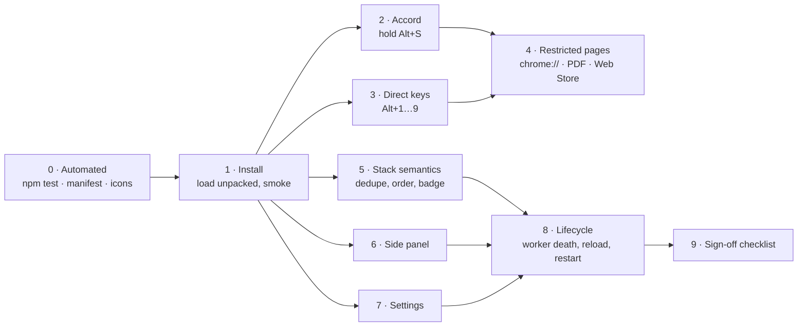
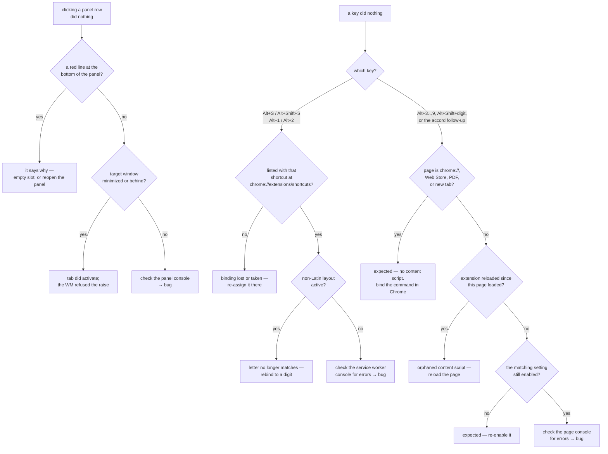

# QA — Tabstack v0.3.1

How to test this extension by hand, end to end. Every case below is written as
**Steps → Expect**, with the exact key, URL, or console snippet to use. A case
that does not match its *Expect* is a bug; the [Not bugs](#not-bugs) section
lists the behaviours that look wrong and are not.

Two things cannot be automated here, which is why this document exists:

- **`chrome.commands` cannot be triggered synthetically.** Neither
  `dispatchEvent` nor CDP `Input.dispatchKeyEvent` fires an extension command —
  Chrome matches those accelerators above the renderer. `Alt+S` must be pressed
  on real hardware.
- **The accord is a *hold*.** Its whole contract is "what happens between
  keydown and keyup", so it needs a human finger on the key.

Everything below the browser — slot arithmetic, chord resolution, settings
validation — *is* automated (`npm test`, 26 tests) and needs no browser at all.



---

## 0 · Automated checks (no browser)

Run from the repo root. These are exactly what CI runs.

```bash
npm test                                  # 26 tests, expect "pass 26  fail 0"
node -e "JSON.parse(require('fs').readFileSync('manifest.json','utf8'))"
python3 tools/make-icons.py && git diff --exit-code -- icons/   # icons reproducible
```

**Expect:** all three exit 0. `npm test` needs Node 20+ (CI uses 22); no
dependencies are installed, `node --test` runs `test/*.test.mjs` directly.

---

## 1 · Install and smoke test

Requires **Chrome 116+** (Side Panel API). Verified against Chrome 151.

| # | Steps | Expect |
| --- | --- | --- |
| 1.1 | `chrome://extensions` → **Developer mode** on → **Load unpacked** → pick the repo root | Card reads *Tabstack 0.3.1*, **no** "Errors" button |
| 1.2 | Click the **service worker** link on the card | DevTools opens on `background.js`, console clean |
| 1.3 | Pin the toolbar icon, click it | Side panel opens showing *Nothing stacked yet* |
| 1.4 | `chrome://extensions/shortcuts` → find Tabstack | Exactly four bindings pre-set: `Alt+S` (stack), `Alt+Shift+S` (panel), `Alt+1`, `Alt+2`. Slots 3–9 and *Remove the last stack item* read **not set** — that is correct, Chrome allows only four `suggested_key` entries |

**Reset to a known state** — do this before each block. In the *service worker*
DevTools console:

```js
await chrome.storage.local.set({ stack: [] });   // empty the stack
await chrome.storage.sync.remove('settings');    // back to DEFAULTS
```

The badge is painted on write, not on read, so it clears on the next real
stack/remove; that lag is expected after a raw storage poke.

**Seed a three-item stack** (for panel/settings tests, avoids clicking around):

```js
const now = Date.now();
await chrome.storage.local.set({ stack: ['a','b','c'].map((h, i) => ({
  id: `${now}-${h}`, url: `https://example.com/${h}`, title: `Seed ${h}`,
  favIconUrl: null, tabId: null, addedAt: now + i,
})) });
```

**Where each console lives:** service worker → the link on the extension card;
content script → the *page's* own DevTools console; side panel → right-click
inside the panel → **Inspect**; options page → it opens in a tab, normal F12.

---

## 2 · The accord (`Alt+S` held)

Do all of these on an ordinary `https://` page — `https://example.com` is fine.
Settings must be at defaults (mode `accord`, HUD on, toasts on).

| # | Steps | Expect |
| --- | --- | --- |
| 2.1 **tap** | Tap `Alt+S` quickly and let go | Toast *Stacked as 1*; badge shows `1`; panel lists the page. No HUD flash |
| 2.2 **hold** | Hold `Alt+S` down for ~1 s | After ~180 ms a dark card appears bottom-right listing the stack with slot numbers, ending in *press 1–9 to jump · ⇧+digit removes · release to stack*. It does **not** disappear on its own while held |
| 2.3 **release commits** | From 2.2, release both keys | HUD vanishes, current tab is stacked (toast *Stacked as N*) |
| 2.4 **jump** | Stack 2–3 different pages first. Then hold `Alt`+`S`, and **while still holding `Alt`**, press `2` | Focus moves to slot 2's tab (its window is raised too). The current tab is **not** stacked — the pending push is cancelled |
| 2.5 **remove** | Hold the accord, press `⇧`+`3` | Toast *Removed slot 3*; slot 3 gone; later slots renumber; nothing stacked |
| 2.6 **abort** | Hold the accord, press `Esc` (still holding `Alt`) | HUD vanishes; nothing stacked, nothing jumped; the page does not see the `Esc` |
| 2.7 **any other key commits** | In the page console run `document.addEventListener('keydown', e => console.log(e.code, 'prevented=', e.defaultPrevented))`. Hold the accord, press `X` | Tab is stacked **and** the console logs `KeyX prevented= false` — the committing key must reach the page. (2.4/2.5/2.6 log `prevented= true`) |
| 2.8 **autorepeat** | Hold `Alt+S` for 3 s without releasing (longer than the 1500 ms hold limit) | Exactly **one** entry appears on release. The repeating `S` re-fires the command; repeats on the same tab restart the timer instead of stacking again |
| 2.9 **hold-limit safety net** | Press `Alt+S`, release **only `S`**, keep `Alt` held and do nothing | After the hold limit (1500 ms default) the tab is stacked anyway and the HUD clears. This is the only path that reaches the timeout |
| 2.10 **blur** | Hold the accord, then click the omnibox with the mouse | Accord ends as a commit — tab stacked — rather than staying armed |
| 2.11 **tab switch mid-accord** | Hold the accord on tab A; without releasing, `Ctrl+Tab` to tab B and press `Alt+S` there | A's pending push commits (A stacked), then B arms. No lost or doubled entries |
| 2.12 **direct mode** | Options → mode **Direct**, then tap `Alt+S` on a fresh page | Stacks instantly, never shows a HUD, and holding does nothing extra. Restore mode to *Accord* afterwards |

---

## 3 · Direct digit keys

| # | Steps | Expect |
| --- | --- | --- |
| 3.1 | With ≥2 items stacked, press `Alt+1` on any page | Jumps to slot 1. This is a bound Chrome command |
| 3.2 | Press `Alt+3` on an ordinary page (slot 3 filled) | Jumps to slot 3 — handled by `content/chord.js`, not by a binding |
| 3.3 | Press `Alt+3` on `chrome://extensions` | **Nothing happens.** No content script can run there; expected, not a bug (3.4 is the workaround) |
| 3.4 | Bind *Jump to stack item 3* to `Alt+3` at `chrome://extensions/shortcuts`, repeat 3.3 | Now it jumps on `chrome://` too |
| 3.5 | `Alt+Shift+4` on an ordinary page | Toast *Removed slot 4*, or *Slot 4 is empty* |
| 3.6 | `Alt+7` with only 3 items stacked | Toast *Slot 7 is empty*; nothing else changes |
| 3.7 | Switch to a Cyrillic (or any non-Latin) layout, press `Alt+3` | Still jumps — the content script matches `event.code`, the physical key. `Alt+S` is Chrome's binding and *may* stop firing under that layout; see [Not bugs](#not-bugs) |
| 3.8 | Numpad: hold the accord, press numpad `4` | Jumps to slot 4 (`Numpad1–9` resolve like the digit row) |

---

## 4 · Pages where no content script runs

The service worker detects that nothing answered its `arm` message and falls
back. Four page classes to cover: `chrome://…`, the Chrome Web Store, the built-in
PDF viewer, and the new tab page.

| # | Steps | Expect |
| --- | --- | --- |
| 4.1 | On `chrome://extensions`, press `Alt+S` | **Nothing is stacked and no toast appears.** `chrome://` URLs are refused (`unsupported-url`) because they cannot be re-opened programmatically, and there is no content script to show the refusal |
| 4.2 | On the new tab page, press `Alt+S` | Same as 4.1 — nothing stacked |
| 4.3 | Open a PDF (e.g. `https://www.w3.org/WAI/ER/tests/xhtml/testfiles/resources/pdf/dummy.pdf`), press `Alt+S` | Stacked **immediately** on keydown, no HUD, no toast. Badge increments |
| 4.4 | On `https://chromewebstore.google.com/`, press `Alt+S` | Same as 4.3 — immediate stack, no HUD |
| 4.5 | On any of the above, press `Alt+1` | Jumps normally — bound commands work everywhere |
| 4.6 | Open a `file:///` page and press `Alt+S` | Stacked. The HUD/toast appear **only** if *Allow access to file URLs* is enabled for the extension in `chrome://extensions`; otherwise it behaves like 4.3 |

---

## 5 · Stack semantics

| # | Steps | Expect |
| --- | --- | --- |
| 5.1 **stability** | Stack A, B, C. Remove B. Stack D | A=1, C=2, D=3. Slots renumber on removal only, and new items append |
| 5.2 **dedupe** | Stack `https://example.com/`, navigate to `https://example.com/#part2`, stack again | Toast *Already at 1*; still one entry; its title/tabId refresh in place (URLs are compared ignoring the fragment) |
| 5.3 **not dedupe** | Stack `https://example.com/a` then `/b` | Two entries — path differences count |
| 5.4 **badge** | Watch the toolbar icon through 5.1 | Blue badge tracks the count exactly; empty string (no badge) at zero |
| 5.5 **reuse open tab** | Stack a page, leave that tab open, switch away, `Alt+1` | The *existing* tab is activated and its window focused — no second copy |
| 5.6 **closed tab** | Stack a page, close its tab, `Alt+1` | Entry survives; a fresh tab opens at that URL and the new tab id is remembered (`tabId` was nulled on close) |
| 5.7 **reuse off** | Options → uncheck *Focus an already-open tab*, repeat 5.5 | A duplicate tab opens instead. Re-check the box afterwards |
| 5.8 **push to top** | Options → *Where a new tab lands* → **Top**. Stack a new page | It becomes slot 1 and everything below renumbers. Restore to *Bottom* |
| 5.9 **beyond 9** | Stack 11 pages | All 11 are listed; rows 10–11 show `·` instead of a number and have no key. Clicking them still works |
| 5.10 **pop** | Bind *Remove the last stack item* at `chrome://extensions/shortcuts`, press it | Last entry disappears |
| 5.11 **minimized window** | Open the stacked page in a second window, **minimize** that window, then jump to its slot | The window is **restored and raised**, not just silently activated behind everything. A bare `focused: true` does not un-minimize — regression watch |
| 5.12 **second window** | Two windows side by side. In window B, click a row whose page is **not** open anywhere | The new tab opens in **window B** — the window you clicked from — not in whichever window Chrome last focused |
| 5.13 **tab closed mid-flight** | Stack a page; with the panel open, close its tab and immediately click its row | Opens fresh. The jump must not fail just because the remembered tab disappeared between the lookup and the focus call |

---

## 6 · Side panel

Open with `Alt+Shift+S` or by clicking the toolbar icon. Seed three items first
(§1). **Click a row once** to give the panel keyboard focus before key tests.

| # | Steps | Expect |
| --- | --- | --- |
| 6.1 | Click a row (not a button) | Jumps to that tab |
| 6.2 | Press `2` with the panel focused | Jumps to slot 2 — bare digit, no `Alt` |
| 6.3 | `↑` / `↓` | Selection highlight moves; nothing is opened |
| 6.4 | `Enter` | Opens the selected row |
| 6.5 | `Backspace` (or `Delete`) | Removes the selected row |
| 6.6 | `Shift+3` | Removes slot 3 |
| 6.7 | `Alt+↑` / `Alt+↓` | The *selected* item moves one position; order changes in place |
| 6.8 | Row buttons `↑` `↓` `✕` | Same three actions, and clicking them does **not** also jump to the row |
| 6.9 | **Clear** | Confirm dialog *Remove all N stacked tabs?* → OK empties it; Cancel changes nothing. With an empty stack the button does nothing |
| 6.10 | **+ Stack tab** | Stacks the active tab of the current window |
| 6.11 | ⚙ | Opens the settings page in a new tab |
| 6.12 **live sync** | Keep the panel open; stack/remove via the keyboard on a page | The panel re-renders immediately — it reads `storage.onChanged`, it does not poll |
| 6.13 | Empty the stack | *Nothing stacked yet* placeholder replaces the list |
| 6.14 | Stack a site with a broken favicon | The icon slot goes blank rather than showing a broken-image glyph |
| 6.15 **failures are visible** | Click a row, then in the SW console run `chrome.storage.local.set({stack: []})` and click where a row used to be | Any failed request writes a red line at the bottom of the panel (*Slot N is empty*). **A click must never fail silently** — that is the bug this line exists to prevent |
| 6.16 **stale panel** | With the panel open, reload the extension on `chrome://extensions`, then click a row | The panel says *Tabstack was reloaded — reopen this panel* instead of doing nothing. Reopening it restores normal behaviour |

---

## 7 · Settings

Open via the panel's ⚙, or right-click the toolbar icon → *Options*.

| # | Steps | Expect |
| --- | --- | --- |
| 7.1 | Toggle anything | *Saved* flashes; **no reload needed anywhere** — the worker and every content script pick it up via `storage.onChanged` |
| 7.2 | Reload the options tab | Every value persists (`chrome.storage.sync`) |
| 7.3 | Mode → **Direct** | The *Hold limit* slider hides; the hint text changes. Switch back → it reappears |
| 7.4 | Drag *Hold limit* | Range is 200–5000 ms; the readout follows the thumb; rapid dragging writes once (150 ms coalesce), not once per pixel |
| 7.5 | Uncheck *Show the slot list* → hold the accord | No HUD, but release still stacks |
| 7.6 | Uncheck *Confirmation bubbles* → stack a tab | No toast; the stack still updates |
| 7.7 | Uncheck *Alt+1…9 jumps* → press `Alt+3` on a page | Nothing happens. `Alt+1`/`Alt+2` **still work** — those are Chrome bindings the setting cannot reach. Expected |
| 7.8 | Uncheck *Alt+⇧+1…9 removes* → `Alt+Shift+2` | Nothing happens |
| 7.9 | **Keyboard shortcuts** list | Mirrors `chrome://extensions/shortcuts` exactly, including *not set* rows. Bind something there, reload options → the new binding shows |
| 7.10 | *Open Chrome's shortcut editor* | Opens `chrome://extensions/shortcuts` in a new tab |
| 7.11 | **Reset to defaults** | Every control snaps back; *Saved* flashes |
| 7.12 **bad storage** | In the SW console: `await chrome.storage.sync.set({settings: {mode: 'telepathy', accordTimeoutMs: 99999}})`, then reload the options page | Shows `accord` / 5000 ms — `normalize()` degrades junk to valid values instead of passing them on |

---

## 8 · Lifecycle

| # | Steps | Expect |
| --- | --- | --- |
| 8.1 **worker death** | `chrome://serviceworker-internals` → find the Tabstack scope → **Stop**. Then press `Alt+1` | The worker wakes and the jump works; the stack is intact |
| 8.2 **worker death mid-idle** | Leave Chrome idle ~5 min, then tap `Alt+S` | Stacks normally |
| 8.3 **extension reload, old page** | Reload the extension on `chrome://extensions` **without** reloading an open page, then press `Alt+S` on that page | The tab is stacked **immediately, with no HUD** — the orphaned content script no longer answers. Reload the page and the accord works again. Expected, not a bug |
| 8.4 **browser restart** | Stack 3 items, quit Chrome fully, reopen | Stack and badge count survive (`storage.local`); settings survive (`storage.sync`) |
| 8.5 **second window** | Stack in window A, jump from window B | Window A is raised and its tab activated — the stack is global, not per-window |
| 8.6 **incognito** | Not supported unless you enable *Allow in incognito*; if you do, the stack is shared with the normal profile | No crash either way |

---

## Not bugs

Confirmed behaviour — do not file these:

- **`Alt+S` does nothing on `chrome://` pages beyond stacking-refusal silence** — `chrome://` URLs are deliberately refused (§4.1), and the refusal toast has nowhere to render.
- **`Alt+3`…`Alt+9` are dead on `chrome://`, the Web Store, the PDF viewer, and the new tab page** — content scripts cannot run there. Bind them in Chrome to fix (§3.4).
- **Only four shortcuts arrive pre-bound.** Chrome's `suggested_key` limit, not an omission.
- **`Alt+F` / `Ctrl+E` cannot be assigned.** Chrome's own accelerators always win; the shortcut editor will accept the keystroke and it will never fire.
- **Slots 10+ have no key.** The accord reads one digit.
- **No drag-to-reorder in the panel** — arrow buttons and `Alt+↑/↓` only.
- **`Alt+S` may stop firing under a non-Latin layout.** That is Chrome's binding matching a letter; rebind to a digit. Everything the extension handles itself keys off `event.code` and is layout-proof.
- **A jump activates the tab but the window does not come forward.** Raising is best effort; a Linux window manager may refuse an app's focus request. The tab *is* active — alt-tab to that window. Only file this if the window is minimized and stays minimized (5.11), which is ours to fix.
- **A push pending mid-accord is lost if Chrome tears the worker down at that instant.** Held in worker memory by design; not observed over the length of a keypress, but not guaranteed.

## Triage



## Reporting a bug

Include: Chrome version (`chrome://version`), extension version, the page URL
class (normal / `chrome://` / PDF / Web Store), the exact keys and whether they
were *held* or *tapped*, the settings that differ from defaults
(`diffFromDefaults` output is ideal), and both consoles — service worker and
page. Then file it: `issue new "tabstack: …"`.

```js
// in the service worker console — a complete state dump for the report
const { stack } = await chrome.storage.local.get('stack');
const { settings } = await chrome.storage.sync.get('settings');
console.log({ stack, settings, commands: await chrome.commands.getAll() });
```

## Sign-off checklist

Minimum pass before tagging a release.

- [ ] §0 — `npm test`, manifest parse, icons reproducible
- [ ] 1.1–1.4 — loads clean, four bindings present
- [ ] 2.1, 2.3, 2.4, 2.5, 2.6 — tap, release, jump, remove, abort
- [ ] 2.8, 2.9 — autorepeat makes one entry; hold limit still commits
- [ ] 3.1, 3.2, 3.5 — bound jump, in-page jump, in-page remove
- [ ] 4.1, 4.3 — `chrome://` refused, PDF stacks immediately
- [ ] 5.1, 5.2, 5.4, 5.5 — order stable, dedupe, badge, tab reuse
- [ ] 6.2, 6.7, 6.9, 6.12 — panel digits, reorder, clear, live sync
- [ ] 5.11, 5.12, 6.15 — minimized window restored, opens in the right window, failures visible
- [ ] 7.1, 7.2, 7.12 — settings apply live, persist, and reject junk
- [ ] 8.1, 8.4 — survives worker death and a browser restart
